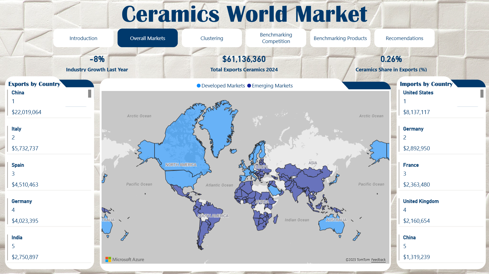
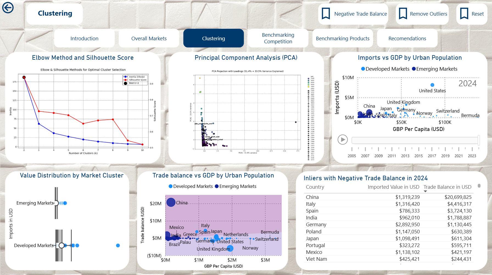
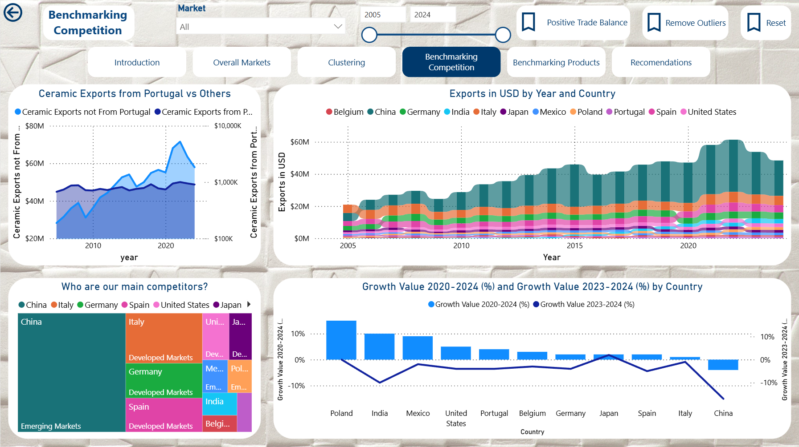
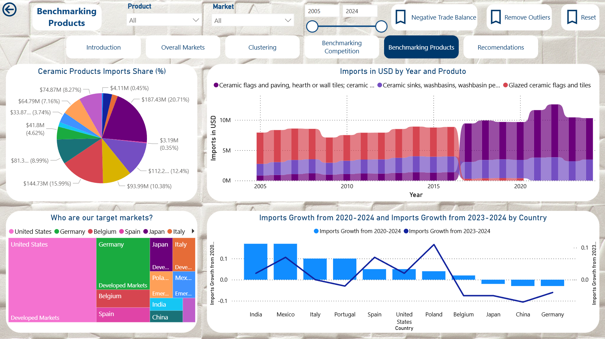

# Ceramics World - Data Warehouse & Power BI

Comprehensive data platform (Python + pandas/SQLAlchemy, Dockerised SQL Server, T-SQL, PowerShell automation, SQL Server Management Studio, Power BI/DAX) that blends Trade Map trade statistics with World Bank macro indicators to understand how Portuguese ceramic exporters compete worldwide. The project demonstrates end-to-end ownership of data ingestion, dimensional modeling, SQL Server automation under Docker, and Power BI storytelling.

---

|  |  |
| --- | --- |
|  |  |

---

## 1. Executive Summary

- **Business need**: identify priority markets for HS 69xx ceramics, quantify Portugal's share, and overlay macroeconomic drivers (GDP per capita, urbanisation, industry growth).
- **Solution**: SQL Server data warehouse populated via Python/SQL ETL, enriched with 2024 calculation tables for instant KPIs, and surfaced through a Power BI executive dashboard.
- **Key capabilities**:
  - Cleansed `DIM_COUNTRY`, `DIM_PRODUCT`, `DIM_DATE` dimensions with surrogate keys.
  - Historical facts for trade, services, and macro series (annual data pinned to `Q4`).
  - 2024 snapshot tables (`CALC_*`) containing pre-computed growth, share, tariff, and logistics metrics.
  - Repeatable load pipeline (`etl/ingest_csv.py`, `sql/10_staging.sql`, `sql/20_dimensions.sql`, `sql/30_facts.sql`).
  - Power BI assets (`Power BI/DAX.md`, `Power BI/Dashboard.pbix`) for interactive analysis.

---

## 2. Index

1. [Executive Summary](#1-executive-summary)
2. [Index](#2-index)
3. [Business Context](#3-business-context)
4. [Objectives](#4-objectives)
5. [Stakeholders and User Roles](#5-stakeholders-and-user-roles)
6. [Why This DW Matters](#6-why-this-dw-matters)
7. [Solution Architecture](#7-solution-architecture)
8. [Source Data Inventory](#8-source-data-inventory)
9. [Data Modeling Highlights](#9-data-modeling-highlights)
10. [Snapshot and KPI Strategy](#10-snapshot-and-kpi-strategy)
11. [ETL / ELT Pipeline](#11-etl--elt-pipeline)
12. [Repository Layout](#12-repository-layout)
13. [Power BI Deliverables](#13-power-bi-deliverables)
14. [Getting Started](#14-getting-started)
15. [Validation and Testing](#15-validation-and-testing)
16. [Operations and Maintenance](#16-operations-and-maintenance)
17. [Roadmap](#17-roadmap)
18. [License](#18-license)

---

## 3. Business Context

Portuguese ceramics compete globally across tiles, sanitaryware, mosaics, and related HS 69xx segments. Market prioritisation requires a consolidated view of:

- Import/export trends per country and product.
- Services activity (construction) that signals downstream demand.
- Macro drivers explaining consumption power.
- Tactical KPIs (tariffs, logistics, share of wallet) for 2024 decision-making.

---

## 4. Objectives

1. **Unify trade and macro data** into a single semantic model optimised for Power BI consumption.
2. **Quantify performance** of Portugal vs global peers, highlighting growth, share, and concentration.
3. **Enable scenario analysis** by surfacing macro correlations and HS-segment breakdowns.
4. **Provide reproducibility**: scripted ETL ensures anyone can rebuild the warehouse end-to-end.

---

## 5. Stakeholders and User Roles

| Role | Needs | Assets |
| --- | --- | --- |
| Executive board | Country prioritisation, KPI snapshots | Power BI dashboard |
| Market analysts | Deep dives by HS code or macro driver | Fact tables + DAX measures |
| Data engineering | Repeatable ingestion, QA | `etl/`, `sql/` scripts |
| Trade team | Quick data extracts | SQL views and calc tables |

---

## 6. Why This DW Matters

- **Speed**: Pre-aggregated `CALC_*` tables keep dashboards responsive even with heavy KPI logic.
- **Consistency**: Surrogate keys aligned across all layers ensure frictionless joins and prevent naming drift.
- **Traceability**: Every metric ties back to a specific Trade Map or World Bank dataset captured under `data/`.
- **Scalability**: The pipeline is extensible to new HS codes or macro indicators by appending staging views and mappings.

---

## 7. Solution Architecture


- **Storage**: SQL Server (`CeramicsWorldDB`), recreated every load for reproducibility.
- **Processing**: Python (pandas + SQLAlchemy) for ingestion, SQL for transformation.
- **Analytics**: Power BI with curated DAX measures (`Power BI/DAX.md`).

---

## 8. Source Data Inventory

| Provider | Dataset | Table(s) | Notes |
| --- | --- | --- | --- |
| Trade Map | Importers historic (HS 69xx) | `FACT_IMP` | Annual values 2005-2024 (Q4 proxy). |
| Trade Map | Exporters historic (Portugal) | `FACT_EXP_PT`, `FACT_EXP_PROD_BY_PT` | Destination and HS code exports. |
| Trade Map | Importers by segment (6907/6908/6910) | `FACT_IMP_SEGMENT` | Country x product intersection. |
| Trade Map | Construction services (imports/exports) | `FACT_IMP_SECTOR`, `FACT_EXP_SECTOR_BY_PT` | Single quarterly lines (world vs Portugal). |
| Trade Map | 2024 exporter/importer snapshots | `CALC_EXP_*`, `CALC_IMP_*` | KPIs: growth, tariffs, distance, rankings. |
| World Bank | GDP per capita (NY.GDP.PCAP.CD) | `FACT_PIB` | USD, annual. |
| World Bank | Urban population (SP.URB.TOTL) | `FACT_URBAN` | Absolute population. |
| World Bank | Industry incl. construction growth (NV.IND.TOTL.KD.ZG) | `FACT_CONSTRUCTION` | Annual percent growth. |

---

## 9. Data Modeling Highlights

- **Dimensions**:
  - `DIM_COUNTRY`: ISO3, continent, region, slug for SEO-friendly routing.
  - `DIM_PRODUCT`: HS 4-digit, section, chapter labels.
  - `DIM_DATE`: year/quarter pairs with decade label; annual series write to the `Q4` row to keep joins uniform.
- **Facts**:
  - Trade (`FACT_EXP_PT`, `FACT_EXP`, `FACT_IMP`, `FACT_IMP_PT`, `FACT_EXP_PROD_BY_PT`, `FACT_IMP_PROD`, `FACT_IMP_SEGMENT`).
  - Services (`FACT_EXP_SECTOR_BY_PT`, `FACT_IMP_SECTOR`) referencing only `DIM_DATE`.
  - Macro (`FACT_PIB`, `FACT_URBAN`, `FACT_CONSTRUCTION`).
- **Calc tables**: 2024 KPIs by country/product enabling instant visuals without complex DAX.

Detailed specs live in `docs/Modelo_Conceptual.md`, `docs/Modelo_Logico.md`, `docs/Modelo_Fisico.md`, `docs/Modelo_Relacional.md`.

---

## 10. Snapshot and KPI Strategy

- Every `CALC_*` table uses the relevant dimension key as primary key (`id_country` or `id_product`).
- Metrics include value/growth deltas, world share, tariff averages, partner distance, rankings, and concentration indices.
- Snapshots are **idempotent**: `sql/30_facts.sql` drops and recreates them each run to avoid drift.

---

## 11. ETL / ELT Pipeline

1. **Environment config**: set `MSSQL_HOST`, `MSSQL_DB`, `MSSQL_USER`, `MSSQL_PASSWORD`, `DATA_PATH` (see `docker/.env` template).
2. **CSV ingestion** (`python etl/ingest_csv.py`):
   - Scans `data/**.csv`.
   - Generates safe SQL table names (`imports_products_csv_trade_map_list_of_imported_products_for_the_selected_product_ceramic_products_xls`).
   - Loads raw data into SQL Server staging schema.
3. **Staging views** (`sql/10_staging.sql`):
   - Cleans country names via `staging.ref_country_lookup`.
   - Normalises HS metadata through `staging.ref_hs_product`.
   - Unpivots annual/quarterly columns, converts percentages to decimals, enforces ISO3 lookups.
4. **Dimensions** (`sql/20_dimensions.sql`):
   - Rebuilds surrogate keys, ensuring only validated ISO3/HS inputs survive.
5. **Facts and calc tables** (`sql/30_facts.sql`):
   - Loads trade, macro, and service facts.
   - Creates KPI snapshots.
   - Applies referential constraints and `ON DELETE NO ACTION`.

---

## 12. Repository Layout

```
data/            # Raw Trade Map and World Bank CSVs
docker/          # Compose files / env samples
docs/            # Conceptual, logical, physical, relational models
etl/             # Python ingestion + helpers
img/             # Dashboard screenshots
powerbi/         # Exploratory notebooks, clustering, PCA
Power BI/        # DAX measures + Dashboard.pbix
sql/             # 10_staging, 20_dimensions, 30_facts scripts
```

---

## 13. Power BI Deliverables

- `Power BI/DAX.md`: curated measures (shares, rankings, clustering, outlier detection) standardising logic.
- `Power BI/Dashboard.pbix`: enterprise storytelling with:
  - Import vs export growth by country.
  - HS 6907/6908/6910 segmentation deep dives.
  - Macro correlations (GDP, urbanisation, construction) vs trade values.
  - Callouts powered by `CALC_*` KPIs.

---

## 14. Getting Started

### Virtualised SQL Server with Docker

1. Copy `docker/.env`, set passwords/volumes, and adjust port mappings if needed.
2. Provision the SQL Server + loader helper stack:
   ```bash
   cd docker
   docker compose up -d
   ```
3. The compose file virtualises the environment so you can rebuild the DW without installing SQL Server locally. Exposed ports let Power BI, SSMS, or scripts connect as if it were a native instance.

*(You can skip this block if you already have an on-prem/Azure SQL Server available.)*

### Steps

1. `pip install -r etl/requirements.txt`
2. Populate `.env` (or `docker/.env`) with SQL Server credentials.
3. Place Trade Map / World Bank CSVs under `data/`.
4. Run ingestion: `python etl/ingest_csv.py`
5. Execute SQL scripts in order:
   ```bash
   sqlcmd -d CeramicsWorldDB -i sql/10_staging.sql
   sqlcmd -d CeramicsWorldDB -i sql/20_dimensions.sql
   sqlcmd -d CeramicsWorldDB -i sql/30_facts.sql
   ```
6. Open `Power BI/Dashboard.pbix`, refresh connections, publish/report.

### SQL Server Management Studio (SSMS)

- Use SSMS to connect to `CeramicsWorldDB` (local or Docker-exposed) for ad-hoc queries, data validation, and performance monitoring.
- Scripts in `sql/` can be executed directly from SSMS if you prefer GUI-based deployments over `sqlcmd`.

---

## 15. Validation and Testing

- **Row-count checks**: staging vs DW after each load (see `sql/30_facts.sql` comments for expectations).
- **Referential integrity**: enforced via foreign keys; load scripts fail fast on orphaned ISO3/HS codes.
- **Metric sanity**: compare `CALC_*` values with Trade Map CSVs (spot-check Portugal and top importers).
- **Power BI refresh**: confirm no relationship warnings post-refresh.

---

## 16. Operations and Maintenance

- **Q4 alignment**: all annual values map to the `Q4` row in `DIM_DATE`; new years require only appending staging data.
- **Snapshots**: rerun `sql/30_facts.sql` whenever new Trade Map 2025+ files arrive to regenerate KPIs.
- **Extensions**:
  - Add HS codes by enriching `staging.ref_hs_product` and re-running ingestion.
  - Add macro indicators by creating new staging views and plugging them into `sql/30_facts.sql`.

---

## 17. Roadmap

1. Automate SQL deployment via `Invoke-Sqlcmd` or GitHub Actions.
2. Add anomaly detection measures (seasonal ARIMA) to `powerbi/`.
3. Integrate logistics/tariff APIs for near real-time snapshots.
4. Publish semantic model to Fabric or Power BI Service as a certified dataset.

---

## 18. License

Educational project released under the MIT License.
