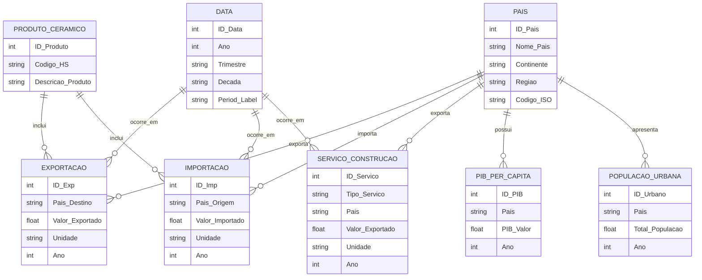

# Modelo Conceptual – Produtos Cerâmicos

## Objetivo

Modelar a informação proveniente das fontes Trade Map e World Bank, com foco em:

- Comércio internacional (importações/exportações de produtos cerâmicos e serviços de construção);
- Indicadores macroeconómicos (PIB per capita, urbanização);
- Identificação de mercados potenciais para expansão de exportações portuguesas.

## Entidades Principais e Significado

| Entidade               | Descrição                                                      | Principais Atributos                                                                                                     |
| ---------------------- | -------------------------------------------------------------- | ------------------------------------------------------------------------------------------------------------------------ |
| **PAIS**               | Unidade geográfica e económica base.                           | ID_Pais *(int)*, Nome_Pais *(string)*, Continente *(string)*, Regiao *(string)*, Codigo_ISO *(string)*                   |
| **PRODUTO_CERAMICO**   | Categoria de produto cerâmico analisado (HS 6907, 6908, 6910). | ID_Produto *(int)*, Codigo_HS *(string)*, Descricao_Produto *(string)*                                                   |
| **EXPORTACAO**         | Exportações portuguesas de produtos cerâmicos.                 | ID_Exp *(int)*, Pais_Destino *(string)*, Valor_Exportado *(float)*, Unidade *(string)*, Ano *(int)*                      |
| **IMPORTACAO**         | Importações de produtos cerâmicos por país.                    | ID_Imp *(int)*, Pais_Origem *(string)*, Valor_Importado *(float)*, Unidade *(string)*, Ano *(int)*                       |
| **SERVICO_CONSTRUCAO** | Serviços de construção exportados por Portugal.                | ID_Servico *(int)*, Tipo_Servico *(string)*, Pais *(string)*, Valor_Exportado *(float)*, Unidade *(string)*, Ano *(int)* |
| **PIB_PER_CAPITA**     | Indicador económico (World Bank).                              | ID_PIB *(int)*, Pais *(string)*, PIB_Valor *(float)*, Ano *(int)*                                                        |
| **POPULACAO_URBANA**   | Indicador de urbanização (World Bank).                         | ID_Urbano *(int)*, Pais *(string)*, Total_Populacao *(float)*, Ano *(int)*                                               |
| **DATA**               | Dimensão temporal comum.                                       | ID_Data *(int)*, Ano *(int)*, Trimestre *(string)*, Decada *(string)*, Period_Label *(string)*                           |

## Relações entre Entidades

- País 1—N Exportação
- País 1—N Importação
- País 1—N Serviço_Construção (exportações de Portugal para vários países)    ?????????????????????
- País 1—N PIB_per_Capita
- País 1—N População_Urbana
- Produto_Cerâmico 1—N Exportação / Importação
- Data 1—N todas as entidades com série temporal

## Diagrama Conceptual (Mermaid.js)

## Resumo das Relações-Chave

| Entidade A       | Relação    | Entidade B                 | Tipo |
| ---------------- | ---------- | -------------------------- | ---- |
| País             | realiza    | Exportação                 | 1:N  |
| País             | realiza    | Serviço_Construção         | 1:N  |
| País             | recebe     | Importação                 | 1:N  |
| País             | possui     | PIB_per_Capita             | 1:N  |
| País             | possui     | População_Urbana           | 1:N  |
| Produto_Cerâmico | compõe     | Exportação / Importação    | 1:N  |
| Data             | referencia | todas as tabelas temporais | 1:N  |
