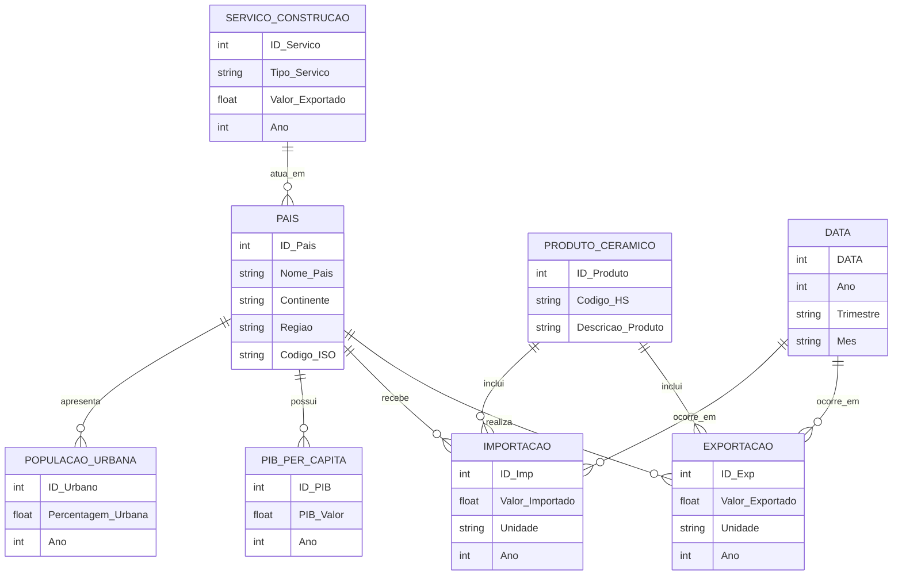

# Modelo Conceptual – Produtos Cerâmicos

## Objetivo

Modelar a informação proveniente das fontes Trade Map e World Bank, com foco em:

- Comércio internacional (importações/exportações de produtos cerâmicos e serviços de construção);
- Indicadores macroeconómicos (PIB per capita, urbanização);
- Identificação de mercados potenciais para expansão de exportações portuguesas.

## Entidades Principais e Significado

| Entidade               | Origem dos Dados                             | Descrição                                                         | Exemplos de Atributos                                        |
| ---------------------- | -------------------------------------------- | ----------------------------------------------------------------- | ------------------------------------------------------------ |
| **País**               | Todas as fontes                              | Unidade geográfica e económica usada como chave comum.            | ID_País, Nome_País, Continente, Região, Código_ISO           |
| **Produto_Cerâmico**   | Trade Map (HS 6907, 6908, 6910)              | Representa a categoria de produto cerâmico exportado/importado.   | ID_Produto, Código_HS, Descrição_Produto                     |
| **Serviço_Construção** | Trade Map (Serviços Exportados – Construção) | Representa serviços de construção relacionados ao setor cerâmico. | ID_Serviço, Tipo_Serviço, Ano, Valor_Exportado               |
| **Exportação**         | Trade Map                                    | Representa as exportações de Portugal por produto e país.         | ID_Exp, País_Destino, Produto, Ano, Valor_Exportado, Unidade |
| **Importação**         | Trade Map                                    | Representa importações por país e produto.                        | ID_Imp, País_Origem, Produto, Ano, Valor_Importado, Unidade  |
| **PIB_per_Capita**     | World Bank                                   | Indicador económico que mede o poder de compra e classe média.    | ID_PIB, País, Ano, PIB_Valor                                 |
| **População_Urbana**   | World Bank                                   | Indicador de urbanização e crescimento populacional.              | ID_Urbano, País, Ano, Percentagem_Urbana                     |
| **Data**               | Derivada de todos                            | Dimensão temporal comum a todas as séries.                        | ID_Data, Ano, Trimestre, Mês                                |

## Relações entre Entidades

- País 1—N Exportação → Um país exporta para vários mercados.
- País 1—N Importação → Um país importa de vários outros.
- Produto_Cerâmico 1—N Exportação / Importação → Cada produto é comercializado por vários países.
- País 1—N PIB_per_Capita / População_Urbana → Um país tem indicadores económicos e sociais anuais.
- Serviço_Construção 1—N País → Cada serviço é associado a um mercado exportador.
- Data 1—N todas as relações → Permite análise temporal transversal.

## Diagrama Conceptual (Mermaid.js)

## Resumo das Relações-Chave

| Entidade A         | Relação   | Entidade B            | Tipo |
| ------------------ | --------- | --------------------- | ---- |
| País               | realiza   | Exportação            | 1:N  |
| País               | recebe    | Importação            | 1:N  |
| País               | possui    | PIB_per_Capita        | 1:N  |
| País               | apresenta | População_Urbana      | 1:N  |
| Produto_Cerâmico   | inclui    | Exportação            | 1:N  |
| Produto_Cerâmico   | inclui    | Importação            | 1:N  |
| Serviço_Construção | atua_em   | País                  | 1:N  |
| Data               | ocorre_em | Exportação/Importação | 1:N  |
