# Modelo Conceptual – Ceramics World

## Objetivo

Unificar as várias fontes (Trade Map, World Bank) num modelo dimensional simples que permita:

- acompanhar exportações/importações de produtos cerâmicos por país e produto;
- analisar o setor de serviços de construção por trimestre;
- expor KPI’s específicos de 2024 (trade balance, ranking, distâncias, tarifas) para países e produtos.

## Entidades (alto nível)

| Entidade                 | Descrição                                                                                         | Principais Atributos                                                                                             |
| ------------------------ | ------------------------------------------------------------------------------------------------- | ---------------------------------------------------------------------------------------------------------------- |
| **DIM_COUNTRY**          | Catálogo único de países/territórios usados em todas as métricas.                                 | `id_country`, `country_name`, `country_code (ISO3)`                                                              |
| **DIM_PRODUCT**          | Catálogo de códigos HS (4 dígitos) relevantes para o domínio cerâmico.                            | `id_product`, `code (HS)`, `product_label`                                                                       |
| **DIM_DATE**             | Dimensão temporal simplificada (ano + trimestre + década).                                        | `id_date`, `year`, `quarter`, `decade`                                                                           |
| **FACT_EXP_PT**          | Exportações de Portugal por país de destino (séries anuais).                                      | `id_country`, `id_date`, `value`                                                                                 |
| **FACT_EXP**             | Exportações mundiais por país exportador (Trade Map).                                             | `id_country`, `id_date`, `value`                                                                                 |
| **FACT_EXP_PROD_BY_PT**  | Exportações de Portugal por código HS.                                                            | `id_product`, `id_date`, `value`                                                                                |
| **FACT_EXP_SECTOR_BY_PT**| Exportações portuguesas de serviços de construção (trimestral).                                   | `id_date`, `value`                                                                                               |
| **FACT_IMP_PT**          | Importações mundiais por país importador (benchmark/competição).                                  | `id_country`, `id_date`, `value`                                                                                |
| **FACT_IMP_PROD_BY_PT**  | Importações por produto (Trade Map).                                                              | `id_product`, `id_date`, `value`                                                                                |
| **FACT_IMP_SECTOR**      | Importações globais de serviços de construção (linha agregada “World”).                           | `id_date`, `value`                                                                                               |
| **CALC_EXP_PT_2024**     | KPIs 2024 para cada destino das exportações portuguesas (trade balance, ranking, distâncias etc.) | `id_country` + métricas (`value_2024_usd`, `trade_balance_2024_usd`, `share_portugal_exports_pct`, …)            |
| **CALC_EXP_2024**        | KPIs 2024 para exportadores mundiais.                                                             | `id_country` + métricas globais                                            |
| **CALC_EXP_PROD_BY_PT**  | KPIs 2024 para produtos exportados por Portugal.                                                  | `id_product` + métricas (crescimentos, ranking, distâncias)                                                      |
| **CALC_IMP_PT_2024**     | KPIs 2024 para países importadores (inclui tarifa média aplicada).                                | `id_country` + métricas                                                    |
| **CALC_IMP_PROD_BY_PT**  | KPIs 2024 para produtos importados.                                                               | `id_product` + métricas                                                    |

> As tabelas CALC_ são “buckets” com indicadores anuais (2024) que não exigem `id_date` porque representam apenas o último ano disponível, mas continuam referenciando `id_country` ou `id_product`.

## Relações principais

- `DIM_COUNTRY` 1:N `FACT_EXP_PT`, `FACT_EXP`, `FACT_IMP_PT`, `CALC_EXP_PT_2024`, `CALC_EXP_2024`, `CALC_IMP_PT_2024`
- `DIM_PRODUCT` 1:N `FACT_EXP_PROD_BY_PT`, `FACT_IMP_PROD_BY_PT`, `CALC_EXP_PROD_BY_PT`, `CALC_IMP_PROD_BY_PT`
- `DIM_DATE` 1:N todas as tabelas fact que representam séries temporais (`FACT_*`, exceto CALC tables)
- `FACT_EXP_SECTOR_BY_PT` e `FACT_IMP_SECTOR` dependem apenas de `DIM_DATE`

## Diagrama (Mermaid)

```mermaid
erDiagram
    DIM_COUNTRY ||--o{ FACT_EXP_PT : destino
    DIM_COUNTRY ||--o{ FACT_EXP : exportador
    DIM_COUNTRY ||--o{ FACT_IMP_PT : importador
    DIM_COUNTRY ||--o{ CALC_EXP_PT_2024 : destino
    DIM_COUNTRY ||--o{ CALC_EXP_2024 : exportador
    DIM_COUNTRY ||--o{ CALC_IMP_PT_2024 : importador

    DIM_PRODUCT ||--o{ FACT_EXP_PROD_BY_PT : produto
    DIM_PRODUCT ||--o{ FACT_IMP_PROD_BY_PT : produto
    DIM_PRODUCT ||--o{ CALC_EXP_PROD_BY_PT : produto
    DIM_PRODUCT ||--o{ CALC_IMP_PROD_BY_PT : produto

    DIM_DATE ||--o{ FACT_EXP_PT : ocorre
    DIM_DATE ||--o{ FACT_EXP : ocorre
    DIM_DATE ||--o{ FACT_EXP_PROD_BY_PT : ocorre
    DIM_DATE ||--o{ FACT_EXP_SECTOR_BY_PT : ocorre
    DIM_DATE ||--o{ FACT_IMP_PT : ocorre
    DIM_DATE ||--o{ FACT_IMP_PROD_BY_PT : ocorre
    DIM_DATE ||--o{ FACT_IMP_SECTOR : ocorre
```

## Resumo

- **Dimensões**: três tabelas pequenas (`DIM_COUNTRY`, `DIM_PRODUCT`, `DIM_DATE`) mantêm chaves substitutas e atributos estáticos.
- **Fact tables**: capturam séries anuais/trimestrais (valor em USD) e alimentam os dashboards.
- **Calc tables**: guardam os indicadores adicionais do snapshot 2024 (rankings, distâncias, tarifas) mantendo o relacionamento via `id_country` / `id_product`.
