# Conceptual Model – Ceramics World

## Objective
Provide a unified view of the global ceramic products market, combining historical trade series with macro indicators that explain demand. The conceptual model drives every downstream design decision.

## Entities
| Entity | Type | Description | Key attributes |
| --- | --- | --- | --- |
| `DIM_COUNTRY` | Dimension | Catalogue of countries/territories with ISO3, continent, region, slug. | `id_country`, `country_name`, `country_code`, `continent`, `region`, `country_slug` |
| `DIM_PRODUCT` | Dimension | HS four-digit codes that define the ceramic portfolio. | `id_product`, `code`, `product_label`, `hs_section`, `hs_chapter` |
| `DIM_DATE` | Dimension | Annual+quarter calendar with decade label (annual facts use the Q4 row as the yearly representative). | `id_date`, `year`, `quarter`, `decade` |
| `FACT_EXP_PT` | Fact | Portuguese exports by destination. | `id_country`, `id_date`, `value` |
| `FACT_EXP` | Fact | World exports by exporter. | `id_country`, `id_date`, `value` |
| `FACT_EXP_PROD_BY_PT` | Fact | Portuguese exports by HS code. | `id_product`, `id_date`, `value` |
| `FACT_EXP_SECTOR_BY_PT` | Fact | Portuguese construction services exports, quarterly single-line series. | `id_date`, `value` |
| `FACT_IMP` | Fact | Global imports by importer. | `id_country`, `id_date`, `value` |
| `FACT_IMP_PT` | Fact | Alternative Trade Map “world imports” series. | `id_country`, `id_date`, `value` |
| `FACT_IMP_PROD` | Fact | Global imports by HS code (Trade Map imported products). | `id_product`, `id_date`, `value` |
| `FACT_IMP_SEGMENT` | Fact | Imports per country for HS 6907/6908/6910. | `id_product`, `id_country`, `id_date`, `value` |
| `FACT_IMP_SECTOR` | Fact | Global construction services imports (world total line). | `id_date`, `value` |
| `FACT_PIB` | Fact | GDP per capita (World Bank). | `id_country`, `id_date`, `gdp_per_capita_usd` |
| `FACT_URBAN` | Fact | Urban population (World Bank). | `id_country`, `id_date`, `urban_population_total` |
| `FACT_CONSTRUCTION` | Fact | Industry incl. construction growth. | `id_country`, `id_date`, `value_added_growth_pct` |
| `CALC_*` | Calc | 2024 KPI snapshots for countries or products (`CALC_EXP_PT_2024`, `CALC_IMP_2024`, etc.). | `id_country` or `id_product` + metrics |

## Key Relationships
- `DIM_COUNTRY` connects 1:N with all fact/calc tables that use countries.
- `DIM_PRODUCT` links HS-driven facts (`FACT_EXP_PROD_BY_PT`, `FACT_IMP_PROD`, `FACT_IMP_SEGMENT`, `CALC_*_PROD_BY_PT`).
- `DIM_DATE` ensures temporal consistency for every fact table (snapshots exclude `id_date`).
- `FACT_EXP_SECTOR_BY_PT` and `FACT_IMP_SECTOR` only depend on date because they are single-line series (Portugal exports and world imports, respectively).

## Diagram

```mermaid
erDiagram
    DIM_COUNTRY ||--o{ FACT_EXP_PT : destination
    DIM_COUNTRY ||--o{ FACT_EXP : exporter
    DIM_COUNTRY ||--o{ FACT_IMP : importer
    DIM_COUNTRY ||--o{ FACT_IMP_PT : importer_hist
    DIM_COUNTRY ||--o{ FACT_IMP_SEGMENT : importer_segment
    DIM_COUNTRY ||--o{ FACT_PIB : pib
    DIM_COUNTRY ||--o{ FACT_URBAN : urban
    DIM_COUNTRY ||--o{ FACT_CONSTRUCTION : construction
    DIM_COUNTRY ||--o{ CALC_EXP_PT_2024 : exp_pt_kpi
    DIM_COUNTRY ||--o{ CALC_EXP_2024 : exp_kpi
    DIM_COUNTRY ||--o{ CALC_EXP_WORLD : exp_world
    DIM_COUNTRY ||--o{ CALC_ALL_EXP_2024 : exp_all
    DIM_COUNTRY ||--o{ CALC_IMP_2024 : imp_all
    DIM_COUNTRY ||--o{ CALC_IMP_PT_2024 : imp_pt
    DIM_COUNTRY ||--o{ CALC_IMP_CER_2024 : imp_cer

    DIM_PRODUCT ||--o{ FACT_EXP_PROD_BY_PT : prod_exp
    DIM_PRODUCT ||--o{ FACT_IMP_PROD : prod_imp
    DIM_PRODUCT ||--o{ FACT_IMP_SEGMENT : prod_seg
    DIM_PRODUCT ||--o{ CALC_EXP_PROD_BY_PT : calc_prod_exp
    DIM_PRODUCT ||--o{ CALC_IMP_PROD_BY_PT : calc_prod_imp

    DIM_DATE ||--o{ FACT_EXP_PT : occurs
    DIM_DATE ||--o{ FACT_EXP : occurs
    DIM_DATE ||--o{ FACT_EXP_PROD_BY_PT : occurs
    DIM_DATE ||--o{ FACT_EXP_SECTOR_BY_PT : occurs
    DIM_DATE ||--o{ FACT_IMP : occurs
    DIM_DATE ||--o{ FACT_IMP_PT : occurs
    DIM_DATE ||--o{ FACT_IMP_PROD : occurs
    DIM_DATE ||--o{ FACT_IMP_SEGMENT : occurs
    DIM_DATE ||--o{ FACT_IMP_SECTOR : occurs
    DIM_DATE ||--o{ FACT_PIB : occurs
    DIM_DATE ||--o{ FACT_URBAN : occurs
    DIM_DATE ||--o{ FACT_CONSTRUCTION : occurs
```

## Highlights
1. **Consistent surrogate keys** (`id_country`, `id_product`, `id_date`) enable frictionless joins in Power BI.
2. **2024 snapshots** provide pre-aggregated KPIs (share, ranking, distance, tariff), keeping dashboards responsive.
3. **Quarter handling**: annual facts store the year on the `Q4` row of `DIM_DATE`, so yearly, quarterly, and snapshot tables stay aligned across SQL scripts.
4. **HS segmentation** (tiles, sanitaryware, mosaics) coexists with macro indicators in the same model.
5. **Macro drivers** (GDP, urbanisation, construction) are aligned temporally with trade to support correlation analyses.
