# Modelo Conceptual – Ceramics World

## Objetivo
Criar uma visão única do mercado global de produtos cerâmicos, conectando séries históricas de comércio com indicadores macroeconómicos que explicam a procura. O modelo conceptual guia todas as decisões de desenho do DW.

## Entidades
| Entidade | Tipo | Descrição | Principais atributos |
| --- | --- | --- | --- |
| `DIM_COUNTRY` | Dimensão | Catálogo de países/territórios com ISO3, continente e região padronizados. | `id_country`, `country_name`, `country_code`, `continent`, `region` |
| `DIM_PRODUCT` | Dimensão | HS Codes de 4 dígitos do portefólio cerâmico. | `id_product`, `code`, `product_label`, `hs_section`, `hs_chapter` |
| `DIM_DATE` | Dimensão | Calendário anual + trimestre (Q1‑Q4) e etiqueta de década. | `id_date`, `year`, `quarter`, `decade` |
| `FACT_EXP_PT` | Fato | Exportações portuguesas por país destino. | `id_country`, `id_date`, `value` |
| `FACT_EXP` | Fato | Exportações mundiais por país exportador. | `id_country`, `id_date`, `value` |
| `FACT_EXP_PROD_BY_PT` | Fato | Exportações portuguesas por HS code. | `id_product`, `id_date`, `value` |
| `FACT_EXP_SECTOR_BY_PT` | Fato | Exportações de serviços de construção (quarterly). | `id_date`, `value` |
| `FACT_IMP` | Fato | Importações mundiais por país importador. | `id_country`, `id_date`, `value` |
| `FACT_IMP_PT` | Fato | Série alternativa do Trade Map “world imports”. | `id_country`, `id_date`, `value` |
| `FACT_IMP_PROD` | Fato | Importações globais por produto (Trade Map imported products). | `id_product`, `id_date`, `value` |
| `FACT_IMP_SEGMENT` | Fato | Importações por país para HS 6907/6908/6910. | `id_product`, `id_country`, `id_date`, `value` |
| `FACT_IMP_SECTOR` | Fato | Importações de serviços de construção (linha World). | `id_date`, `value` |
| `FACT_PIB` | Fato | PIB per capita (World Bank). | `id_country`, `id_date`, `gdp_per_capita_usd` |
| `FACT_URBAN` | Fato | População urbana (World Bank). | `id_country`, `id_date`, `urban_population_total` |
| `FACT_CONSTRUCTION` | Fato | Crescimento da indústria incl. construção. | `id_country`, `id_date`, `value_added_growth_pct` |
| `CALC_*` | Calc | Snapshots 2024 com KPIs prontos para BI (`CALC_EXP_PT_2024`, `CALC_IMP_2024`, etc.). | `id_country` ou `id_product` + métricas específicas |

## Relações-chave
- `DIM_COUNTRY` relaciona-se 1:N com todas as tabelas factuais e de cálculo baseadas em países.
- `DIM_PRODUCT` liga os factos orientados a HS code (`FACT_EXP_PROD_BY_PT`, `FACT_IMP_PROD`, `FACT_IMP_SEGMENT`, `CALC_EXP_PROD_BY_PT`, `CALC_IMP_PROD_BY_PT`).
- `DIM_DATE` garante consistência temporal de todas as séries (`FACT_*`), com exceção das tabelas `CALC_*`, que representam snapshots anuais.
- `FACT_EXP_SECTOR_BY_PT` e `FACT_IMP_SECTOR` dependem apenas da dimensão de data, pois representam linhas globais.

## Diagrama (Mermaid)

```mermaid
erDiagram
    DIM_COUNTRY ||--o{ FACT_EXP_PT : destino
    DIM_COUNTRY ||--o{ FACT_EXP : exportador
    DIM_COUNTRY ||--o{ FACT_IMP : importador
    DIM_COUNTRY ||--o{ FACT_IMP_PT : importador_hist
    DIM_COUNTRY ||--o{ FACT_IMP_SEGMENT : importador_segmento
    DIM_COUNTRY ||--o{ FACT_PIB : pib
    DIM_COUNTRY ||--o{ FACT_URBAN : urban
    DIM_COUNTRY ||--o{ FACT_CONSTRUCTION : constr
    DIM_COUNTRY ||--o{ CALC_EXP_PT_2024 : exp_pt_kpi
    DIM_COUNTRY ||--o{ CALC_EXP_2024 : exp_kpi
    DIM_COUNTRY ||--o{ CALC_EXP_WORLD : exp_world
    DIM_COUNTRY ||--o{ CALC_ALL_EXP_2024 : exp_all
    DIM_COUNTRY ||--o{ CALC_IMP_2024 : imp_all
    DIM_COUNTRY ||--o{ CALC_IMP_PT_2024 : imp_pt
    DIM_COUNTRY ||--o{ CALC_IMP_CER_2024 : imp_cer

    DIM_PRODUCT ||--o{ FACT_EXP_PROD_BY_PT : prod_exp
    DIM_PRODUCT ||--o{ FACT_IMP_PROD : prod_imp
    DIM_PRODUCT ||--o{ FACT_IMP_SEGMENT : prod_seg
    DIM_PRODUCT ||--o{ CALC_EXP_PROD_BY_PT : calc_prod_exp
    DIM_PRODUCT ||--o{ CALC_IMP_PROD_BY_PT : calc_prod_imp

    DIM_DATE ||--o{ FACT_EXP_PT : ocorre
    DIM_DATE ||--o{ FACT_EXP : ocorre
    DIM_DATE ||--o{ FACT_EXP_PROD_BY_PT : ocorre
    DIM_DATE ||--o{ FACT_EXP_SECTOR_BY_PT : ocorre
    DIM_DATE ||--o{ FACT_IMP : ocorre
    DIM_DATE ||--o{ FACT_IMP_PT : ocorre
    DIM_DATE ||--o{ FACT_IMP_PROD : ocorre
    DIM_DATE ||--o{ FACT_IMP_SEGMENT : ocorre
    DIM_DATE ||--o{ FACT_IMP_SECTOR : ocorre
    DIM_DATE ||--o{ FACT_PIB : ocorre
    DIM_DATE ||--o{ FACT_URBAN : ocorre
    DIM_DATE ||--o{ FACT_CONSTRUCTION : ocorre
```

## Destaques do Modelo
1. **Chaves consistentes** (`id_country`, `id_product`, `id_date`) garantem que qualquer combinação de KPIs pode ser cruzada no BI.
2. **Snapshots 2024** aceleram dashboards ao evitar cálculos on-the-fly para métricas críticas (quota, ranking, distância média, tarifa).
3. **Segmentação HS**: permite comparar azulejos, sanitários e mosaicos de forma granular, mantendo contexto macro na mesma base.
4. **Drivers macroeconómicos**: PIB, urbanização e crescimento industrial estão alinhados temporalmente com o comércio para análises de correlação.
