# Modelo Conceptual – Ceramics World

## Objetivo
Integrar as diferentes fontes (Trade Map, World Bank e séries auxiliares) num modelo dimensional
que permita comparar Portugal com o resto do mundo no mercado de produtos cerâmicos e nos
drivers macroeconómicos relacionados (PIB, urbanização e construção).

## Entidades
| Entidade | Tipo | Descrição | Principais Atributos |
| --- | --- | --- | --- |
| `DIM_COUNTRY` | Dimensão | Catálogo único de países/territórios (ISO3, continentes, regiões). | `id_country`, `country_name`, `country_code`, `region`, `continent` |
| `DIM_PRODUCT` | Dimensão | HS Codes a 4 dígitos relevantes para o portefólio cerâmico. | `id_product`, `code`, `product_label`, `hs_section` |
| `DIM_DATE` | Dimensão | Calendário simplificado (ano + trimestre + década) usado pelas séries factuais. | `id_date`, `year`, `quarter`, `decade_label` |
| `FACT_EXP_PT` | Fato | Exportações de Portugal por destino e ano. | `id_country`, `id_date`, `value` |
| `FACT_EXP` | Fato | Exportações globais por país exportador (Trade Map). | `id_country`, `id_date`, `value` |
| `FACT_EXP_PROD_BY_PT` | Fato | Exportações portuguesas por HS code. | `id_product`, `id_date`, `value` |
| `FACT_EXP_SECTOR_BY_PT` | Fato | Exportações portuguesas de serviços de construção (Q a Q). | `id_date`, `value` |
| `FACT_IMP` | Fato | Importações mundiais por importador (Trade Map, 2005‑2024). | `id_country`, `id_date`, `value` |
| `FACT_IMP_PT` | Fato | Séries históricas alternativas obtidas do dataset “world imports” (Trade Map). | `id_country`, `id_date`, `value` |
| `FACT_IMP_PROD_BY_PT` | Fato | Importações globais por HS code. | `id_product`, `id_date`, `value` |
| `FACT_IMP_SEGMENT` | Fato | Importações por importador para HS 6907/6908/6910 (tiles e sanitários). | `id_product`, `id_country`, `id_date`, `value` |
| `FACT_IMP_SECTOR` | Fato | Importações mundiais de serviços de construção (linha “World”). | `id_date`, `value` |
| `FACT_PIB` | Fato | PIB per capita (World Bank – NY.GDP.PCAP.CD). | `id_country`, `id_date`, `gdp_per_capita_usd` |
| `FACT_URBAN` | Fato | População urbana total (World Bank – SP.URB.TOTL). | `id_country`, `id_date`, `urban_population_total` |
| `FACT_CONSTRUCTION` | Fato | Crescimento anual da indústria (incl. construção) – NV.IND.TOTL.KD.ZG. | `id_country`, `id_date`, `value_added_growth_pct` |
| `CALC_EXP_PT_2024` | Calc | KPIs 2024 dos destinos das exportações portuguesas (share, ranking, distância, tarifa). | `id_country` + métricas |
| `CALC_EXP_2024` | Calc | KPIs 2024 de exportadores cerâmicos (Trade Map). | `id_country` + métricas |
| `CALC_EXP_WORLD` | Calc | KPIs 2024 de exportadores considerando todos os produtos cerâmicos. | `id_country` + métricas |
| `CALC_ALL_EXP_2024` | Calc | KPIs 2024 de exportadores para o universo Total Trade Map. | `id_country` + métricas |
| `CALC_IMP_2024` | Calc | KPIs 2024 de importadores (todos os produtos) provenientes do ficheiro all-products. | `id_country` + métricas |
| `CALC_IMP_PT_2024` | Calc | KPIs 2024 dos principais parceiros importadores (cerâmica) incluindo tarifa média. | `id_country` + métricas |
| `CALC_IMP_CER_2024` | Calc | KPIs 2024 do Trade Map para importadores de produtos cerâmicos. | `id_country` + métricas |
| `CALC_EXP_PROD_BY_PT` | Calc | KPIs 2024 por produto exportado por Portugal. | `id_product` + métricas |
| `CALC_IMP_PROD_BY_PT` | Calc | KPIs 2024 por produto importado. | `id_product` + métricas |

As tabelas `CALC_*` guardam snapshots do último ano disponível (2024); por isso não têm `id_date` mas
mantêm FKs para `DIM_COUNTRY` ou `DIM_PRODUCT`.

## Relações-Chave
- `DIM_COUNTRY` possui relacionamento 1:N com todas as tabelas fact/calc baseadas em país:
  `FACT_EXP_PT`, `FACT_EXP`, `FACT_IMP`, `FACT_IMP_PT`, `FACT_IMP_SEGMENT`, `FACT_PIB`, `FACT_URBAN`,
  `FACT_CONSTRUCTION`, `CALC_EXP_PT_2024`, `CALC_EXP_2024`, `CALC_EXP_WORLD`, `CALC_ALL_EXP_2024`,
  `CALC_IMP_2024`, `CALC_IMP_PT_2024`, `CALC_IMP_CER_2024`.
- `DIM_PRODUCT` relaciona-se com `FACT_EXP_PROD_BY_PT`, `FACT_IMP_PROD_BY_PT`, `FACT_IMP_SEGMENT`,
  `CALC_EXP_PROD_BY_PT` e `CALC_IMP_PROD_BY_PT`.
- `DIM_DATE` liga-se a todas as fact tables temporais (todas as `FACT_*`), exceto as tabelas `CALC_*`
  que representam snapshots anuais.
- `FACT_EXP_SECTOR_BY_PT` e `FACT_IMP_SECTOR` ligam-se apenas a `DIM_DATE`, pois representam séries agregadas.

## Diagrama (Mermaid)

```mermaid
erDiagram
    DIM_COUNTRY ||--o{ FACT_EXP_PT : destino
    DIM_COUNTRY ||--o{ FACT_EXP : exportador
    DIM_COUNTRY ||--o{ FACT_IMP : importador_snapshot
    DIM_COUNTRY ||--o{ FACT_IMP_PT : importador_hist
    DIM_COUNTRY ||--o{ FACT_IMP_SEGMENT : importador_segmento
    DIM_COUNTRY ||--o{ FACT_PIB : pib
    DIM_COUNTRY ||--o{ FACT_URBAN : urban
    DIM_COUNTRY ||--o{ FACT_CONSTRUCTION : constr_growth
    DIM_COUNTRY ||--o{ CALC_EXP_PT_2024 : destino_kpi
    DIM_COUNTRY ||--o{ CALC_EXP_2024 : export_kpi
    DIM_COUNTRY ||--o{ CALC_EXP_WORLD : export_world
    DIM_COUNTRY ||--o{ CALC_ALL_EXP_2024 : export_all
    DIM_COUNTRY ||--o{ CALC_IMP_2024 : import_all
    DIM_COUNTRY ||--o{ CALC_IMP_PT_2024 : import_pt
    DIM_COUNTRY ||--o{ CALC_IMP_CER_2024 : import_cer

    DIM_PRODUCT ||--o{ FACT_EXP_PROD_BY_PT : produto_exp
    DIM_PRODUCT ||--o{ FACT_IMP_PROD_BY_PT : produto_imp
    DIM_PRODUCT ||--o{ FACT_IMP_SEGMENT : produto_seg
    DIM_PRODUCT ||--o{ CALC_EXP_PROD_BY_PT : calc_prod_exp
    DIM_PRODUCT ||--o{ CALC_IMP_PROD_BY_PT : calc_prod_imp

    DIM_DATE ||--o{ FACT_EXP_PT : ocorre
    DIM_DATE ||--o{ FACT_EXP : ocorre
    DIM_DATE ||--o{ FACT_EXP_PROD_BY_PT : ocorre
    DIM_DATE ||--o{ FACT_EXP_SECTOR_BY_PT : ocorre
    DIM_DATE ||--o{ FACT_IMP : ocorre
    DIM_DATE ||--o{ FACT_IMP_PT : ocorre
    DIM_DATE ||--o{ FACT_IMP_PROD_BY_PT : ocorre
    DIM_DATE ||--o{ FACT_IMP_SEGMENT : ocorre
    DIM_DATE ||--o{ FACT_IMP_SECTOR : ocorre
    DIM_DATE ||--o{ FACT_PIB : ocorre
    DIM_DATE ||--o{ FACT_URBAN : ocorre
    DIM_DATE ||--o{ FACT_CONSTRUCTION : ocorre
```

## Resumo
O modelo conceptual mantém três dimensões pequenas e numerosas tabelas de fatos/calcs:
- Fact tables cobrem séries anuais/trimestrais de comércio, serviços e indicadores macroeconómicos.
- Calc tables armazenam KPIs de 2024 vindos do Trade Map (exportadores/importadores e produtos) para
  acelerar o consumo no Power BI.
- Todos os datasets partilham chaves substitutas consistentes (`id_country`, `id_product`, `id_date`),
  permitindo cruzar KPIs, séries históricas e informação complementar no mesmo dashboard.
