# Modelo Relacional – Ceramics World

## Estrutura Geral

Arquitetura em estrela com dimensões `DIM_COUNTRY`, `DIM_PRODUCT`, `DIM_DATE` ligando fact tables (`FACT_*`) e tabelas de KPIs (`CALC_*`). As tabelas CALC guardam apenas o snapshot 2024 e referenciam `DIM_COUNTRY` ou `DIM_PRODUCT`.

## Dimensões

`DIM_COUNTRY (id_country, country_name, country_code)`  
`DIM_PRODUCT (id_product, code, product_label)`  
`DIM_DATE (id_date, year, quarter, decade)`

## Fact tables

| Tabela                   | Chaves estrangeiras                       | Descrição                                               |
| ------------------------ | ----------------------------------------- | ------------------------------------------------------- |
| `FACT_EXP_PT`            | `id_country → DIM_COUNTRY`, `id_date → DIM_DATE` | Exportações de Portugal por país / ano                 |
| `FACT_EXP`               | `id_country → DIM_COUNTRY`, `id_date → DIM_DATE` | Exportações mundiais                                    |
| `FACT_EXP_PROD_BY_PT`    | `id_product → DIM_PRODUCT`, `id_date → DIM_DATE` | Exportações de Portugal por HS                          |
| `FACT_EXP_SECTOR_BY_PT`  | `id_date → DIM_DATE`                       | Serviços de construção exportados (Portugal)            |
| `FACT_IMP_PT`            | `id_country → DIM_COUNTRY`, `id_date → DIM_DATE` | Importações mundiais por país                           |
| `FACT_IMP_PROD_BY_PT`    | `id_product → DIM_PRODUCT`, `id_date → DIM_DATE` | Importações por HS                                      |
| `FACT_IMP_SECTOR`        | `id_date → DIM_DATE`                       | Serviços de construção importados (linha “World”)       |

Modelo simplificado (Mermaid):

```mermaid
erDiagram
    DIM_COUNTRY ||--o{ FACT_EXP_PT : destino
    DIM_COUNTRY ||--o{ FACT_EXP : exportador
    DIM_COUNTRY ||--o{ FACT_IMP_PT : importador
    DIM_COUNTRY ||--o{ CALC_EXP_PT_2024 : destino
    DIM_COUNTRY ||--o{ CALC_EXP_2024 : exportador
    DIM_COUNTRY ||--o{ CALC_ALL_EXP_2024 : exportador_total
    DIM_COUNTRY ||--o{ CALC_IMP_PT_2024 : importador

    DIM_PRODUCT ||--o{ FACT_EXP_PROD_BY_PT : produto
    DIM_PRODUCT ||--o{ FACT_IMP_PROD_BY_PT : produto
    DIM_PRODUCT ||--o{ CALC_EXP_PROD_BY_PT : produto
    DIM_PRODUCT ||--o{ CALC_IMP_PROD_BY_PT : produto

    DIM_DATE ||--o{ FACT_EXP_PT : ocorre
    DIM_DATE ||--o{ FACT_EXP : ocorre
    DIM_DATE ||--o{ FACT_EXP_PROD_BY_PT : ocorre
    DIM_DATE ||--o{ FACT_EXP_SECTOR_BY_PT : ocorre
    DIM_DATE ||--o{ FACT_IMP_PT : ocorre
    DIM_DATE ||--o{ FACT_IMP_PROD_BY_PT : ocorre
    DIM_DATE ||--o{ FACT_IMP_SECTOR : ocorre
```

## Tabelas de KPIs 2024

| Tabela                   | FK                     | Campos principais                                                                                 |
| ------------------------ | ---------------------- | -------------------------------------------------------------------------------------------------- |
| `CALC_EXP_PT_2024`       | `id_country`           | `value_2024_usd`, `trade_balance_2024_usd`, `% share`, `growth_20_24`, `average distance`, `tariff` |
| `CALC_EXP_2024`          | `id_country`           | KPIs globais (share mundial, crescimento, distância, concentração)                                 |
| `CALC_ALL_EXP_2024`      | `id_country`           | KPIs globais considerando todos os produtos (Total Trade Map)                                      |
| `CALC_EXP_PROD_BY_PT`    | `id_product`           | KPIs 2024 por produto exportado (crescimentos, ranking, share, distância)                          |
| `CALC_IMP_PT_2024`       | `id_country`           | KPIs 2024 por país importador (crescimentos, share, tarifa)                                       |
| `CALC_IMP_PROD_BY_PT`    | `id_product`           | KPIs 2024 por produto importado (crescimentos, distâncias)                                        |

Essas tabelas mantêm uma linha por país/produto e não utilizam `id_date`, pois representam apenas o snapshot 2024.
