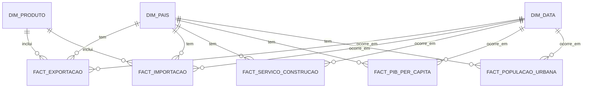

# Modelo Relacional – Data Warehouse Power BI Ceramics World

## Estrutura Geral

O modelo segue uma arquitetura em estrela (Star Schema), com três tabelas dimensionais principais (`DIM_PAIS`, `DIM_PRODUTO`, `DIM_DATA`) e cinco tabelas fato (`FACT_EXPORTACAO`, `FACT_IMPORTACAO`, `FACT_SERVICO_CONSTRUCAO`, `FACT_PIB_PER_CAPITA`, `FACT_POPULACAO_URBANA`).

## Tabelas Dimensionais

`DIM_PAIS`

| Coluna     | Tipo         | Chave | Descrição                   |
| ---------- | ------------ | ----- | --------------------------- |
| ID_Pais    | INT          | PK    | Identificador único do país |
| Nome_Pais  | VARCHAR(100) |       | Nome oficial                |
| Continente | VARCHAR(50)  |       | Continente                  |
| Regiao     | VARCHAR(100) |       | Região económica/geográfica |
| Codigo_ISO | CHAR(3)      |       | Código ISO Alpha-3          |

`DIM_PRODUTO`

| Coluna            | Tipo         | Chave | Descrição                               |
| ----------------- | ------------ | ----- | --------------------------------------- |
| ID_Produto        | INT          | PK    | Identificador único do produto cerâmico |
| Codigo_HS         | VARCHAR(20)  |       | Código harmonizado (HS)                 |
| Descricao_Produto | VARCHAR(255) |       | Descrição do produto                    |

`DIM_DATA`

| Coluna       | Tipo         | Chave | Descrição                      |
| ------------ | ------------ | ----- | ------------------------------ |
| ID_Data      | INT          | PK    | Identificador temporal         |
| Ano          | INT          |       | Ano                            |
| Trimestre    | CHAR(2)      |       | Exemplo: Q1, Q2                |
| Mes          | TINYINT      |       | Mês numérico (1-12)            |
| Decada       | VARCHAR(10)  |       | Exemplo: “2010s”               |
| Period_Label | VARCHAR(12)  |       | Exemplo: “2017_Q3_09” (AAAA_Qn_MM) |

## Tabelas Factos

`FACT_EXPORTACAO`

| Coluna          | Tipo        | Chave | FK | Descrição                                |
| --------------- | ----------- | ----- | -- | ---------------------------------------- |
| ID_Exp          | INT         | PK    |    | Identificador da exportação              |
| ID_Pais         | INT         |       | ✅  | País de destino                          |
| ID_Produto      | INT         |       | ✅  | Produto cerâmico                         |
| ID_Data         | INT         |       | ✅  | Período                                  |
| Valor_Exportado | FLOAT       |       |    | Valor total exportado                    |
| Unidade         | VARCHAR(20) |       |    | Unidade de medida (USD, toneladas, etc.) |
| Ano             | INT         |       |    | Ano da operação                          |

Relações:

- FK(ID_Pais) → DIM_PAIS(ID_Pais)
- FK(ID_Produto) → DIM_PRODUTO(ID_Produto)
- FK(ID_Data) → DIM_DATA(ID_Data)

`FACT_IMPORTACAO`

| Coluna          | Tipo        | Chave | FK | Descrição                   |
| --------------- | ----------- | ----- | -- | --------------------------- |
| ID_Imp          | INT         | PK    |    | Identificador da importação |
| ID_Pais         | INT         |       | ✅  | País importador             |
| ID_Produto      | INT         |       | ✅  | Produto cerâmico            |
| ID_Data         | INT         |       | ✅  | Período                     |
| Valor_Importado | FLOAT       |       |    | Valor total importado       |
| Unidade         | VARCHAR(20) |       |    | Unidade de medida           |
| Ano             | INT         |       |    | Ano da operação             |

Relações:

- FK(ID_Pais) → DIM_PAIS(ID_Pais)
- FK(ID_Produto) → DIM_PRODUTO(ID_Produto)
- FK(ID_Data) → DIM_DATA(ID_Data)

`FACT_SERVICO_CONSTRUCAO`

| Coluna          | Tipo         | Chave | FK | Descrição                          |
| --------------- | ------------ | ----- | -- | ---------------------------------- |
| ID_Servico      | INT          | PK    |    | Identificador do serviço           |
| ID_Pais         | INT          |       | ✅  | País destino                       |
| ID_Data         | INT          |       | ✅  | Período                            |
| Tipo_Servico    | VARCHAR(100) |       |    | Categoria (ex: “Construção civil”) |
| Valor_Exportado | FLOAT        |       |    | Valor exportado                    |
| Unidade         | VARCHAR(20)  |       |    | Unidade (USD)                      |
| Ano             | INT          |       |    | Ano de referência                  |

Relações:

- K(ID_Pais) → DIM_PAIS(ID_Pais)
- FK(ID_Data) → DIM_DATA(ID_Data)

`FACT_PIB_PER_CAPITA`

| Coluna    | Tipo  | Chave | FK | Descrição               |
| --------- | ----- | ----- | -- | ----------------------- |
| ID_PIB    | INT   | PK    |    | Identificador           |
| ID_Pais   | INT   |       | ✅  | País                    |
| ID_Data   | INT   |       | ✅  | Período                 |
| PIB_Valor | FLOAT |       |    | Valor do PIB per capita |
| Ano       | INT   |       |    | Ano de referência       |

Relações:

- FK(ID_Pais) → DIM_PAIS(ID_Pais)
- FK(ID_Data) → DIM_DATA(ID_Data)

`FACT_POPULACAO_URBANA`

| Coluna          | Tipo  | Chave | FK | Descrição              |
| --------------- | ----- | ----- | -- | ---------------------- |
| ID_Urbano       | INT   | PK    |    | Identificador          |
| ID_Pais         | INT   |       | ✅  | País                   |
| ID_Data         | INT   |       | ✅  | Período                |
| Total_Populacao | FLOAT |       |    | População urbana total |
| Ano             | INT   |       |    | Ano de referência      |

Relações:

- FK(ID_Pais) → DIM_PAIS(ID_Pais)
- FK(ID_Data) → DIM_DATA(ID_Data)

